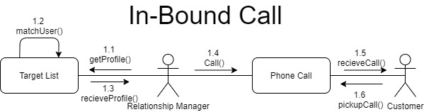
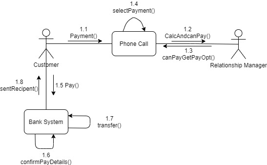

# 1. Problem Definition
## 1.1 Project Objectives

 The project's primary goals are to create a new information system solution for usage inside a call management centre, that will assist employees with the management of calls and customer profiles, in order to improve efficiency in selling holiday packages. The current  system does not provide the call centre with the ability to match customers to Relationship Managers (RM’s) dynamically based on the RM’s past performances and does not allow for customers to be matched with the most suitable RM available at the time. The current solution is basic with no processes in place to help maximise the effectiveness of the call centres pairings, so this is a key objective of the newly proposed system. The current system in place is causing a loss of revenue for the company as customers are less likely to be matched with appropriate RM’s and are then less likely to continue and make a purchase. 

 The introduction of both RM and customer profiling will be the backbone of improving the call centres efficiency by creating meaningful matches between their employees and clients. The profiling system will create an individual profile for every RM and customer that will later be used to pair RM’s to customers on both inbound and outbound calls. The key components of the customer profiles will be information on demographics and whether they are a repeat customer, while the RM’s profile will determine their skill level and knowledge on selling certain holiday packages. This will help rectify the current disconnect between customers and getting an appropriate RM with the skills and knowledge relating to their intended holiday destination. Fulfilling the objectives of the new profiling system, and customer pairing should provide an ample solution to the companies current problems of inefficiency. 

## 1.2 Stakeholder Identification

 The call management system consists of 4 main stakeholders whereby the table below aims to show who are these stakeholders and what are their responiblities or roles to which they contribute to the current system. 

Stakeholder | Role/ Responibility
----------- | --------------------
Relationship Manager (RM) | 
 RM's along with the customers are the main users of the call management system. Their primary role is sell holiday packages to customers. The call managment system will effectively improve the relationship manager's role by matching a RM to a customer based on the RM's profile. 

End Customers | 
 End customers are stakeholders who have preivously brought a holiday package/ have their profile already registered in the system. The development of the call management system must play an important role to easily integrate & retain this customer base during the development phase. 

Potential Customers | 
 Potential customers are customers who are within the target market of the product. They are yet to purchase a product but are with likely probability to potentially become a user of the product. The call management system should ensure that the current system does not defer potential customer's from purchasing a holiday package. 

Developers | 
 Developers are the creaters of the Call Management System. Their role is to implement & maintance the call management system based on the requirements of each stakeholder. 

## 1.3 Stakeholders Empathy Maps
### 1.3.1 Relationship Managers
**Who are we empathizing with?**

 Relationship Managers (RM's), RM’s are the main employees of the call centre and have the role of interacting with customers and potential buyers 

**What do they need to do?**

 Due to their experience, during development of the new system they may be able to provide some guidance on what they think appropriate criteria for changing the call flow rate may be. 

**What do they see?**

 As call centre employees they commonly see their jobs being outsourced overseas to areas that can provide cheaper labour so this would be a source of worry for them. With the development of this new system they may see it as an inconvenience as now the call flow rate will be determined on a performance basis rather than random as it was before. 

**What do they say?**

* Relationship managers will inform the customers of the holiday packages including
* Price
* Duration
* Terms and conditions
* Insurance policies

**What do they do**

 Their main job at the moment is to try and make sales of holiday packages. With success being determined by how many packages are sold. 

**What do they hear**

 They would be constantly hearing from colleagues the issues of being a part of a call centre team such as worries of job security and how long they will continue doing their job. 

**What do they think and feel?**

Pains:
* 
 Lose current job due to a new outperforming system. The system could become biased depending on whose RM profile matches customers the most. 

* Not having enough input to how the system they use works.

Gains:
* For the system to improve the number of customers they are able to win favour of
* They need to maintain their employment to continue providing for themselves or their family.

### 1.3.2 End Customers
**Who are we empathizing with?**

 The End customers are the customers who currently exist in the system and are the main recipient of the current Call System in-use. 

**What do they need to do?**

 End customers will need to set up their account, user profile, whilst having to continuously let the system know if there are any changes in personal details. End customer will also be required to dial a number reaching the CMC which will automatically route them to a branch. 

**What do they see?**

 End customers are expected to receive calls from the system that will connect them to the relationship manager. They’re more likely to take priority as customers with a highest score are served first. 

**What do they say?**

 Potential customers may ask for a quote on holiday packages or discuss what package the package entails. Things they may ask - How long is the holiday? Cost of holiday? Insurance policies? They will also let the relationship manage know if they’re interested in purchasing a product. 

**What do they do?**

 End customer’s should listen to what the product package offers and potentially state whether they are or not interested in purchasing the holiday package. If they’re interested they will be required to provide purchasing details. If they’re not interested they can tell the relationship manager and end the conversation or call. 

**What do they hear**

* 
 During a call with end customers they will hear the relationship manager speak about in depth details on the holiday package. 
 
* 
 Externally , they may hear from friends and family the annoyances of increased telemarketing calls and scams 

**What do they think and feel?**

Pains:	
* Annoyance of telemarketers calling them.	
* Holiday package is not suitable for them - waste of time for customers	

Gains 
* They may be offered a package they’re interested in purchasing.
* 
 Fulfil a dream of purchasing the package of their choice and going on a holiday to the destination they wish to go to. 

### 1.3.3 Potential Customers

**Who are we empathizing with?**

 A potential customer is one who is not currently using the system but it is highly likely they will use it, as relationship managers (RM’s) call them and try to sign them up for different holiday packages. 

**What do they need to do?**

 Potential customers will be required to create a customer profile/account so that they can utilise the information system service. This allows the system to easily match the customers to the relationship manager based on their needs & skills. 

**What do they see?**

 Potential customers may see the RM’s as an inconvenience if they are not expecting them to reach out and call them. The potential customers probably see many phone call made to them from other telemarketing agencies that may be outsourced overseas with operators who are not highly skilled, this causes them to have a disinterest in all marketing calls. 

**What do they say?**

 Some potential customers are receptive and become customers who purchase holiday packages and are grateful for the work of the RM’s, while other potential customers will be annoyed at being contacted and will say to not make contact with them again. 

**What do they do?**

Potential customers cover a wide number of people from all walks of life and can be

**What do they hear**

* 
 During a call with end customers they will hear the relationship manager speak about in depth details on the holiday package. 

* 
 Externally, they may hear from friends and family the annoyances of increased telemarketing calls and scams 

**What do they think and feel?**

Pains
* 
 The people who are conversing with them are not trustworthy or are dangerous (scammers). 

* 
 That by purchasing for a package on their phone they have been phished and then scammed because of their lack of knowledge.	

Gains: 
* 
 They will ultimately have a desire to go on holiday at some point and would benefit from being sold a holiday package. 

### 1.3.4 Developers

**Who are we empathizing with?**

 Developers are the people responsible for creating the new system for the travel company. They have been contracted by the company to improve the call management centre and play the crucial role of making the project successful. 

**What do they need to do?**

 They will need to elicit all the necessary requirements from current users of the system and work on implementing solutions that reflect the customers needs. 

**What do they see?**

 They see a changing technology landscape where emphasis by younger generations is no longer placed on communication over telephone. 

**What do they say?**

 Developers should inform the company what functionalities are possible based on the budget of the project. If a requirement cannot be met, they should let the company know why and how they may resolve the issue. 

**What do they do?**

* 
 Develop the software of the calling system to match the requirements sent out to them, from the company. 

* 
 They will also be required to maintain the software to ensure the functionalities are up to date. 

**What do they hear?**

 They would have heard the company’s requirements of the information system. 

**What do they think and feel?**

Pains
* 
 May be worried that their final solution could put some people out of a job 
 
* 
 Want to provide a good final solution so the customer is happy and may use their companies services again. 

Gains
* 
 Worry that if they can’t provide a quality final solution they may gain a negative reputation in the industry. 

* 
 Improve the customers calling experience and have more successful sales made. 

# 2. Design Thinking

## 2.1 Design Thinking

 The approach taken for the design thinking process was to split it up into the usual seven areas of design thinking namely: empathize, define, ideate, prototype and test. By starting to empathize with the (possible and determined) stakeholders the goal of the project is to develop a Calling Management System which will be able to put their service at a much more competitive level to meet their competitors strengths and their customer’s demands in particular. 

 Empathizing is very vague and nothing much is known of what we are empathizing about, thus by using an Empathy Map it becomes possible to document and comment on the users of the future system and their feelings such as what they think, feel, see, say, hear or even do about their current system or even the future system to come. Via their emotions it becomes clear on what is needed for the future system in comparison to the current one and can be used to develop User Stories an artefact used to create the base of the future system. 

 Through the immersion of the consumers (End Customers) thoughts and the other main users (the relationship managers) the needs of the users can be defined and their point of views (PoV’s) on the topic are developed. By means of these PoV’s we develop How Might We (HMW) statements to provide potential solutions to the users of the future system using logically created and inferred statements. These HMW statements are indisputably well used in providing brainstorming ideas for the ideation phase. These ideas are also the potential solutions which were carved out from the point of views otherwise the issues or the user’s worries. It is from these ideas that they are firstly selected for their potential and then their feasibility before moving on to the Prototyping Phase. 

 As emphasized by the agile manifesto values especially “Customer Collaboration over Contract Negotiation”, it is important to remember that the ideas to be prototyped should be developed in iterations and as such, each prototyped idea must encompass its ability answer any questions raised and to most importantly discern out any issues with the prototype with constant testing. Re-iterative and constant testing will prove to be highly advantageous as live-user participation will provide the most valuable feedback to creating a working software and at the same time helps to mold the system into what is wanted by the stakeholders in particular. Therefore, this ultimately helps to clear up misunderstandings between the developed prototype versus what is actually needed. 

## 2.2 Scrum Utilization

 Scrum comes as a subset of agile development methodology where the project has a framework that ensures the completion within the deadline that assigned for the project. Scrum shares several principles with agile development methodology such as continuous improvements and collaboration on self-organised teams’ level which assist in producing a high-quality product with rapid delivery time. Aside from the similarities, scrum stands out as a preferable system development process benefiting from teamwork models where it could increase the productivity, flexibility and creativity throughout the process. 

 Iteration is a crucial part of Scrum development where improvement can be made easily without affecting other parts of the project. By having small iteration, the feedback collected from product owner in any stage during the development process could be implemented without having a significant financial impact as well as different request for additional features or fixing existing bugs within the project. 

 For the project scrum was chosen as the preferred methodology in order to manage the tasks assigned while the due date of the project in consideration. In order to stay in contact with all members developing the system and product owner, a repository Using the online software Github has been created. Github would allow the product owner to monitor the work on the project throughout the entire process and add any recommendations at all time or highlights any changes that are required while the project is in progress. Developers would benefit from using Github as well as customers, Github allows developers to list all their tasks with the ability to sort these tasks depending on the priority of the task for each stage. Github would be an essential part of the work in cases where physical meetings are limited. As scrum requires 15 minutes daily meeting to discuss the progress made for all members of the development team. 

  
# 3. Workproducts, Models and Descriptions
## 3.1 User Stories
Based on the stakeholders and their empathy maps above, the set journey of use cases were found and could be categorized mainly into 4 major steps each with its own branching architecture. These journeys were namely:
* Profile Creation
* RM and Customer Matching
* Call Redirection 
* Payment

<table>
    <thead>
        <tr>
            <th>Use Case Category</th>
            <th>User Story ID</th>
            <th>User Story</th>
        </tr>
    </thead>
    <tbody>
        <tr>
            <td rowspan=4><b>1. RM Creating Customer Profile</b></td>
            <td>US101</td>
            <td>As an RM, If a customer doesn't have a profile, when making one for them I want fields such as customer phone number prefilled based on what number is calling me</td>
        </tr>
        <tr>
            <td>US102</td>
            <td>USstory</td>
        </tr>
        <tr>
            <td>US103</td>
            <td>USstory</td>
        </tr>
        <tr>
            <td>US104</td>
            <td>USstory</td>
        </tr>
        <tr>
            <td rowspan=8><b>2. Match RM and Customer</b></td>
            <td>US201</td>
            <td>As the CMC, I want the system to use the questionnaire given to the new Employees so that it can automatically develop a specialised RM Profile with their skill matrix stored in it.</td>
        </tr>
        <tr>
            <td>US202</td>
            <td>As a RM i want to be able to be matched with customer's based on my profile so that i can provide the best experience for customers.</td>
        </tr>
         <tr>
            <td>US203</td>
            <td>As a RM, I want the system to provide me a list of potential customer's based on my preferences and abilities with all the necessary details of the customer's to provide for their needs and questions.</td>
        </tr>
         <tr>
            <td>US204</td>
            <td>As a customer i want to be able to call the company and be matched with a RM so that i can purchase a holiday package</td>
        </tr>
         <tr>
            <td>US205</td>
            <td>As the CMC, I need the system to be able to assign a skill score to each RM's profile based on their previous call histories</td>
        </tr>
         <tr>
            <td>US206</td>
            <td>As a RM I want to be able to view rating scores given to customers so that i can contact customers with high scores</td>
        </tr>
         <tr>
            <td>US207</td>
            <td>As a RM i want to be able to communicate to customers who speak a language i'm proficient in so that i can give the best possible service</td>
        </tr>
        <tr>
            <td>US208</td>
            <td>As a RM i want to be able to input my performance and product knowledge so that the system can match me well</td>
        </tr>
         <tr>
            <td rowspan="3"><b>Interactive Voice Response</b></td>
            <td>US301</td>
            <td>a</td>
        </tr>
        <tr>
            <td>US302</td>
            <td>a</td>
        </tr>
        <tr>
            <td>US303</td>
            <td>a</td>
        </tr>
        <tr>
            <td rowspan="2"><b>Payment</b></td>
            <td>US401</td>
            <td></td>
        </tr>
        <tr>
            <td>US402</td>
            <td></td>
        </tr>
    </tbody>
</table>

## 3.2 Use Case Diagram

## 3.3 Class Diagram

## 3.4 Activity Diagram

This section aims to showcase a select few use cases with their modelled activity diagrams to display their how they will operate within the system.

### 3.4.1 Select Package

### 3.4.2 Make Payment

### 3.4.3 Inbound Outbound Calls

## 3.5 Collaborative Diagram (Interaction Diagram)

### 3.5.1 Calls

#### 3.5.1.1 Outbound Calls

.jpg)

#### 3.5.1.2 Inbound Calls

### 3.5.2 Payment

# 4. System Evaluation

## 4.1 Reflections and Assumptions

 The statements below encompass the assumptions and reflections made for the developed Call Management System especially on certain tasks and areas. 

__Payment Method__

 From the system we realised that for the customers to pay for their desired holiday packages, the system must be able to support various payment methods such as Card, EFT, Telegraphic Transfer, Paypal and etc. Hence, we require that our system should be able to support such payment features for ease of payment if our customers are not present in the shop itself. 

__Set of tasks to perform on the System__

 For the system to provide the necessary features we need the development team to be able to create the necessary programs and tools required for the Call Management Centre to succeed in its new calling-system. Such features can include profiling of customers or even sorting customer’s to the most appropriate and similarly described Relationship Managers to ease on the traffic of the calls during Inbound and Outbound Calls. 

__Maintenance and Support of Product after Development__

 For the system to be successful, the system needs to be developed in a way that it can be easily updated in the future to compensate for any bugs created as a result of produced features required in the system. The developers should be able to communicate between new developers of the written software to be able to easily hand-over the project in case of any switches in the team so that the work may continue smoothly even after development 

__Receive a Target List__

 Relationship managers should also be able to view their targeted list so that they can contact customers who are more likely to purchase a holiday package at the right time. 

__Update Profiles__

 Relationship managers profiles are initialized during the start of their career at the company. We realised the RMs should be able to update their profile throughout their career in case there is any sudden changes in circumstances (e.g they learn to speak a new language and can be matched with additional customers). 

__Peak Hours are Considered (Busy Time)__

 We decided that a busy time is determined by when all relationship managers are currently on a call. During a busy time all inbound calls should be redirected to the interactive Voice Response. 

## 4.2 Point of View Statements
User | Needs to | Insight
---- | -------- | -------
End & Potential Customers | Payment method online | Customers should be able to make payments through EFT or card.
Developer | Set of tasks to perform on the system | Developers should be getting feedback on the usability of the process and possible improvements required.
Developer | Continue to maintain & support the product after development | Developers should continue to fix issues or any bugs that may occur in the future.
Relationship Managers | Receive a Target List | The RMs should be able to use the list to determine the most likely customers to purchase a holiday package in an outbound call
Relationship Managers | Profiles are able to be updated whenever needed | Profiles are initialised at hiring therefore RM’s should be able to update their profile whenever they need to should their personal information or repetoire change
Developers | Busy time is considered when all RM are currently in a call | Busy time is considered when all Relationship Managers are currently in a call with customers

## 4.3 How Might We Statements
HMW | Potential Solutions 
------- | -------------------------
HMW improve the payment system for customers? | <ul><li>The RM or System is able to provide the user with an immediate link to a payment page with their desired package to be paid for</li><li>The system is able to handle the users input actions and follow through with the appropriate payment methods for the user</li></ul>|
HMW provide the feedback to the developers in a way they are able to understand? | <ul><li>A simple bullet point list with simple language used to convey any issues found in the system</li><li>A mind-map can be used to list out all the current issues by linking them with a specific area or feature in the system.</li><li>The relationship managers should actively work with the developers by constantly providing feedback so that the developers may cater with the needs of the system properly</li></ul>
HMW discover the bugs to be found in the system? | <ul><li>The developers should try and actively test the features of the system and create a simple documentation to record any issues found</li><li>The developers should try and keep the code as clean as possible to prevent as many errors so that it does not waste unnecessary amounts of time</li></ul>
HMW allow our developers to fix the bugs in time for release dates? | <ul><li> The developers should try and actively test the features of the system and create a simple documentation to record any issues found. </li><li> The developers should try and keep the code as clean as possible to prevent as many errors so that it does not waste unnecessary amounts of time </li></ul>
HMW enable the relationship manager to view the current target list? | <ul><li> Developers have enabled a way for relationship managers to view a targeted list. </li><li> Relationship managers are able to view the list by a button created by developers  </li></ul>
HMW improve the current relationship management profile to allow for customisation | <ul><li> Relationship managers are able to access their profile. </li><li> Relationship managers are able to make edits at any time as long as they have access to the application. </li></li><li> Edit may include languages proficiencies, experience and product knowledge. </li></ul>
HMW develop a way for the call management system to determine busy times | <ul><li> Customers will redirect as soon as all the phone lines in the office are full. </li><li> Phone lines are disconnected if there are no employees working during that time.  </li></ul>

## 4.4 Competitive Advantage of the System 

The development of the central management system has effectively improved the interactive experience between both customers and relationship managers. CMC aims to gain a competitive advantage over holiday call companies by matching the skills of the relationship manager to cater to customers who call in. The result allows customers to speak to relationship managers who may have a higher level of proficiency in the same language and also are able to suggest products based on the RM’s product knowledge and experience. The CMC also allows the system to maintain customers who call in during a busy time by putting them on a wait list - this way customers know exactly how long they are expected to wait and can decide if they would like to hang up or wait the given amount of time. CMC also stores information on past customers, this will help the company develop a prolonged relationship with loyal customers as RM’s are more likely to contact customers who receive a higher rating score by the CMC system.

## 4.5 Possible Failure of the Developed System

